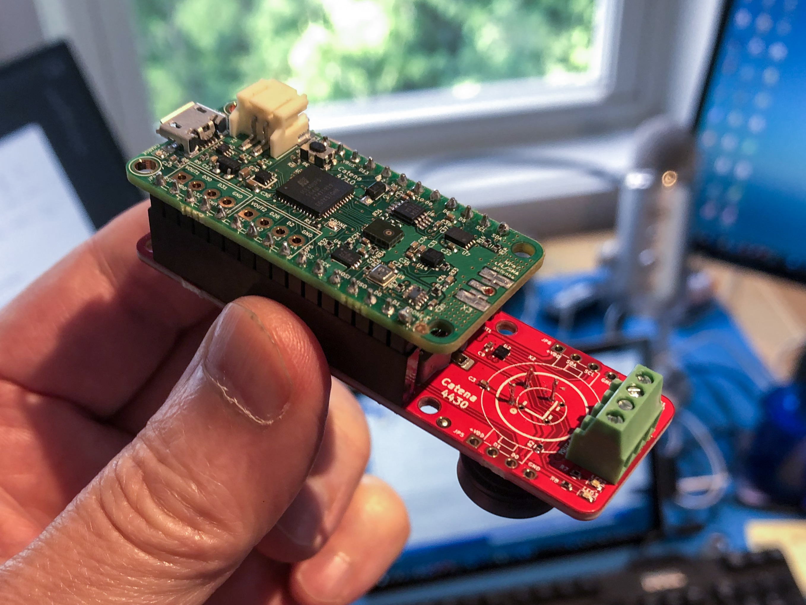
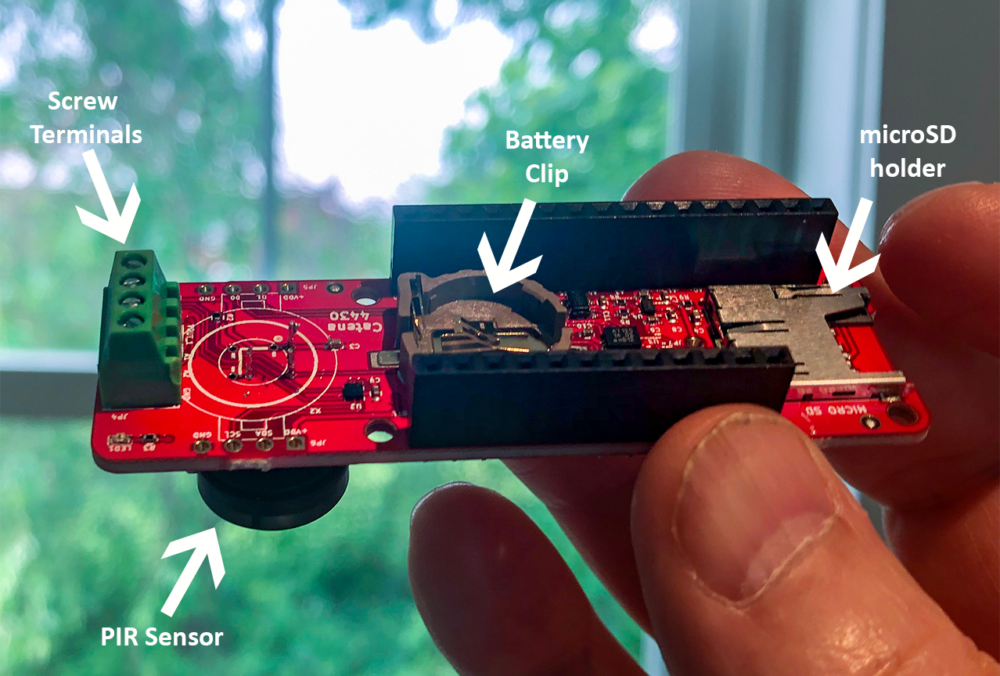

# MCCI-Catena-4430 library

This library provides Arduino support for the MCCI Catena&reg; 4430 Feather Wing.

<!-- markdownlint-disable MD033 -->
<!-- markdownlint-capture -->
<!-- markdownlint-disable -->
<!-- TOC depthFrom:2 updateOnSave:true -->

- [Introduction](#introduction)
- [Key classes](#key-classes)
	- [`cPCA9570` I2C GPIO controller](#cpca9570-i2c-gpio-controller)
	- [`c4430Gpios` Catena 4430 GPIO Control](#c4430gpios-catena-4430-gpio-control)
	- [`cPIRdigital` PIR monitor class](#cpirdigital-pir-monitor-class)
	- [`cTimer` simple periodic timer class](#ctimer-simple-periodic-timer-class)
- [Integration with Catena 4610](#integration-with-catena-4610)
- [Example Sketches](#example-sketches)
- [Additional code for dashboards](#additional-code-for-dashboards)
- [Meta](#meta)
	- [License](#license)
	- [Support Open Source Hardware and Software](#support-open-source-hardware-and-software)
	- [Trademarks](#trademarks)

<!-- /TOC -->
<!-- markdownlint-restore -->
<!-- Due to a bug in Markdown TOC, the table is formatted incorrectly if tab indentation is set other than 4. Due to another bug, this comment must be *after* the TOC entry. -->

## Introduction

The MCCI Catena 4430 Feather Wing is an accessory for Adafruit Feather-compatible CPU boards such as the Adafruit Feather M0 or the MCCI Catena 4610.

With an MCCI Catena 4610 mounted, the assembly looks like this:

Prior to assembly, the Catena 4430 looks like this:

The Catena 4430 adds the following functions to any compatible Feather-like board.

- Passive Infrared (PIR) motion sensor. This can be mounted on the front or back or the board.

- A battery-backed real-time clock (compatible with Adafruit's [Adalogger FeatherWing](https://www.adafruit.com/product/2922)).

- An SD-card slot similar to the Adalogger, but different in a couple of ways. First the SD-card is electrically buffered going to and from the system; it can't interfere with the SPI bus when you're not using it. Second, the SD-card slot has a dedicated power supply that is off by default.

- Three additional lights (red, green, and blue).

- A GPIO screw terminal with four posts: two I/O signals, power, and ground. The power at the screw terminal can also be turned on and off under software control.

## Key classes

### `cPCA9570` I2C GPIO controller

This class models the hardware of PCA9570 I2C GPIO expander. It has no knowledge of how the PCA9570 is wired up.

### `c4430Gpios` Catena 4430 GPIO Control

This class models the GPIOs of the Catena 4430. It understands the wiring and polarities so that clients can use method like `c4330Gpios::setBlue()` to turn on the blue LED.

### `cPIRdigital` PIR monitor class

This class monitors the digital output from the PIR and accumulates an activity estimate.

### `cTimer` simple periodic timer class

This class simplifies the coding of periodic events driven from the Arduino `loop()` routine.

## Integration with Catena 4610

The Catena 4610 has the following features.

- LoRaWAN-compatible radio and software

- Bosch BME280 temperature/humidity/pressure sensor

- Silicon Labs Si1133 ambient light sensor

## Example Sketches

The `catena4630-pm7003-demo` example sketch allows interactive use of the PMS7003.

The `catena4630-pm7003-lora` example is a completely worked remote sensor sketch with power management.

## Additional code for dashboards

Check the [extra](./extra) directory for information about decoding data from LoRaWAN messages, and Node-RED and Grafana assets for presenting the data using the [docker-ttn-dashboard](https://github.com/mcci-catena/docker-ttn-dashboard).

## Meta

### License

This repository is released under the [MIT](./LICENSE) license. Commercial licenses are also available from MCCI Corporation.

### Support Open Source Hardware and Software

MCCI invests time and resources providing this open source code, please support MCCI and open-source hardware by purchasing products from MCCI, Adafruit and other open-source hardware/software vendors!

For information about MCCI's products, please visit [store.mcci.com](https://store.mcci.com/).

### Trademarks

MCCI and MCCI Catena are registered trademarks of MCCI Corporation. LoRaWAN is a registered trademark of the LoRa Alliance. LoRa is a registered trademark of Semtech Corporation. All other marks are the property of their respective owners.
